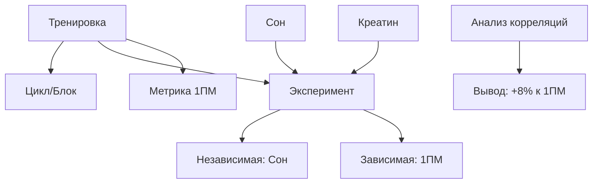

# 📋 ЧТО СДЕЛАНО: Полный обзор изменений GetFitBot

## ✅ Реализованные изменения для Telegram Mini App

### 1. 🔐 Telegram WebApp Интеграция

#### `index.html` - Инициализация Telegram WebApp
```html
<script>
  window.TelegramWebAppInit = function() {
    if (window.Telegram && window.Telegram.WebApp) {
      const tg = window.Telegram.WebApp;
      tg.expand(); // На весь экран
      tg.setHeaderColor('#0b0f12'); // Цвет хедера
      tg.setBackgroundColor('#0b0f12'); // Цвет фона
      tg.enableClosingConfirmation(); // Подтверждение закрытия
      tg.ready(); // Готово
      window.telegramInitData = tg.initData; // Для аутентификации
      window.telegramUser = tg.initDataUnsafe?.user; // Данные юзера
    }
  };
</script>
```

**Что дает:**
- ✅ Открывается внутри Telegram
- ✅ Автоматическая аутентификация по telegram_id
- ✅ Правильные цвета под тему Telegram
- ✅ Доступ к initData для безопасной авторизации

#### `src/main.tsx` - React компонент инициализации
```typescript
function TelegramInitWrapper() {
  useEffect(() => {
    const initTelegram = () => {
      if (window.Telegram && window.Telegram.WebApp) {
        const tg = window.Telegram.WebApp;
        tg.expand();
        tg.setHeaderColor('#0b0f12');
        tg.setBackgroundColor('#0b0f12');
        tg.ready();
      }
    };
    initTelegram();
  }, []);
  return null;
}
```

**Что дает:**
- ✅ Дублирование инициализации на уровне React
- ✅ Логирование в консоль для отладки

---

### 2. 🗄️ База данных и хранение

#### Варианты хранения данных:

| Вариант | Плюсы | Минусы | Когда использовать |
|---------|-------|--------|-------------------|
| **localStorage** | Мгновенно, бесплатно | Только в браузере | Тесты, демо |
| **JSON файлы** (`data/`) | Простота, видно данные | Нет concurrent access | Личное использование |
| **Google Sheets** | Визуально, экспорт | Медленнее (~1-2с) | Для себя + друзья |
| **Supabase** | SQL, real-time | Нужно учить SQL | Продакшен |

#### `server.ts` - Cloud Sync API
```typescript
// Синхронизация по telegram_id
app.get('/api/db/sync/:userId', ...)
app.post('/api/db/sync/:userId', ...)

// Friend Battles (мультиплеер)
app.get('/api/battles')
app.post('/api/battles/create')
app.post('/api/battles/update-progress')
```

**Что работает:**
- ✅ Персистентное хранение на сервере
- ✅ Синхронизация между устройствами
- ✅ Мультиплеер (Friend Battles)

---

### 3. 🤖 ИИ API: Groq + Gemini

#### `server.ts` - Dual AI Engine
```typescript
async function callUnifiedAI(options) {
  // 1. Пробуем Groq (быстро, <500ms)
  if (preferGroq && GROK_KEY) {
    const groqContent = await tryGroq();
    if (groqContent) return { text: groqContent, provider: 'groq' };
  }
  
  // 2. Фолбэк на Gemini
  const geminiContent = await tryGemini();
  if (geminiContent) return { text: geminiContent, provider: 'gemini' };
  
  return { text: '', provider: 'heuristic' };
}
```

**Почему Groq основной:**
- ⚡ Скорость: <500ms vs 2-5сек у Gemini
- 🎯 JSON режим: работает идеально
- 📈 Лимиты: 30 запросов/мин (vs 15 у Gemini)
- ✅ Стабильность: не "перегружен"

**Настройка:**
```bash
# .env
GROQ_API_KEY=gsk_...  # получи на https://console.groq.com
GEMINI_API_KEY=...    # опционально, фолбэк
```

---

### 4. 📱 Telegram Bot интеграция

#### Команды бота:
```
/start - Открыть главное меню и Мини-апп
/help - Справка и возможности
/ranks - Нормативы и спортивные разряды
```

#### NLI (Natural Language Interface):
Можно писать боту прямо в чат:
```
"сделал жим 100кг на 8 раз" → Записывает тренировку
"спал 7 часов" → Лог сна
"вес 85кг" → Обновляет профиль
```

#### Уведомления:
```typescript
app.post('/api/telegram/send-workout-report', ...)
app.post('/api/telegram/send', ...)
```

**Примеры:**
- "🏆 Тренировка завершена! 45 мин, 12500 кг тоннаж"
- "⏰ Пора на тренировку! (День ног)"
- "🔥 Через 3 дня рекорд в жиме!"

---

### 5. 📊 Объяснение фич для гибкости

#### A. Периодизация (Training Blocks)
**Где:** Лаборатория → "Периодизация"

**Типы блоков:**
```typescript
type BlockType = 
  | 'hypertrophy'  // Гипертрофия (объем)
  | 'strength'     // Сила (интенсивность)
  | 'deload'       // Разгрузка
  | 'recomp'       // Рекомпозиция
  | 'endurance'    // Выносливость
  | 'custom';      // Кастомный
```

**Пример использования:**
```
Блок "Силовой пик WRPF" (4 недели)
├─ Неделя 1: 85% × 5, RPE 8
├─ Неделя 2: 90% × 3, RPE 8.5
├─ Неделя 3: 95% × 2, RPE 9
└─ Неделя 4: Тест 1ПМ
```

**Зачем:** Планирование прогресса, избежание плато

---

#### B. Конструктор метрик
**Где:** Лаборатория → "Метрики & R"

**Типы метрик:**
```typescript
type MetricType = 
  | 'numeric'      // Число (HRV, вес)
  | 'scale'        // Шкала 1-10 (боль, стресс)
  | 'boolean'      // Да/нет (креатин)
  | 'categorical'  // Категория (настроение)
```

**Примеры:**
| Метрика | Тип | Единица | Зачем |
|---------|-----|---------|-------|
| HRV | numeric | мс | Восстановление |
| Боль в колене | scale | 1-10 | Травмы |
| Креатин | boolean | да/нет | Добавки |
| Стресс | scale | 1-10 | Кортизол |
| Время реакции | numeric | мс | ЦНС |

**Как создать:**
1. Лаборатория → "Метрики & R"
2. "+ Новая метрика"
3. Название + тип + единица

---

#### C. Связки между сущностями
**Концепция:** Всё связано со всем



**Пример query:**
```
"Покажи все тренировки в цикле 'Сила' 
 где был креатин и сон >8ч, 
 и средний 1ПМ"
```

---

#### D. Автоматические триггеры
**Реализация в `server.ts`:**

```typescript
// Триггер: время
if (hour === 18 && !workoutToday) {
  sendNotification("⏰ Пора на тренировку!");
}

// Триггер: пропуск
if (missedWorkouts >= 2) {
  sendNotification("😕 Ты пропускаешь. Всё ок?");
}

// Триггер: рекорд близко
if (current1RM > personalBest * 0.95) {
  sendNotification("🔥 Готовься к рекорду!");
}

// Триггер: усталость
if (fatigueScore > 8) {
  sendNotification("📉 Нужна разгрузка");
}
```

**Когда срабатывают:**
- По расписанию (cron)
- При изменении данных (webhook)
- При открытии приложения (on mount)

---

#### E. Экспорт/Импорт
**CSV экспорт тренировок:**
```csv
date,exercise,weight,reps,rpe,1RM
2025-01-15,Жим лежа,100,8,8,126
2025-01-15,Присед,140,5,9,168
```

**JSON backup:**
```json
{
  "user": { "name": "Alex", "weight": 85 },
  "workouts": [...],
  "experiments": [...],
  "metrics": [...]
}
```

**Google Sheets sync:**
- См. `googleAppsScript.js`
- POST запросы на Apps Script URL
- Авто-логирование в реальном времени

---

### 6. 🎯 Марафоны vs Эксперименты

#### Марафоны (Discipline Marathons)
**Цель:** Дисциплина, привычки

**Примеры:**
- "30 дней × 10k шагов"
- "14 дней без пропусков"
- "21 день белок 2г/кг"

**Механика:**
```typescript
interface Marathon {
  dailyGoal: number;      // 10000 шагов
  currentDay: number;     // 15 из 30
  bankedSurplus: number;  // +2000 (перевыполнение)
  status: 'active' | 'completed' | 'failed';
}
```

#### Эксперименты (Research Lab)
**Цель:** Поиск причинно-следственных связей

**Примеры:**
- "Креатин → +X% тоннаж"
- "Сон 8ч → +Y% 1ПМ"
- "Кофеин → снижение RPE"

**Механика:**
```typescript
interface Experiment {
  hypothesis: string;
  independentMetrics: ['Креатин 5г', 'Сон 8ч'];
  dependentMetric: '1ПМ Жим';
  dailyLogs: { date, values, result };
  aiConclusion: { correlation, effect%, pValue };
}
```

**Разница:**
- Марафон = "Делай каждый день"
- Эксперимент = "Проверь гипотезу"

---

## 📁 Созданные файлы

### 1. `.env` - Переменные окружения
```bash
TELEGRAM_BOT_TOKEN=...
GROQ_API_KEY=gsk_...
GEMINI_API_KEY=...
GOOGLE_APPS_SCRIPT_URL=...
APP_URL=https://...
SUPABASE_URL=...
SUPABASE_ANON_KEY=...
```

### 2. `DEPLOY_GUIDE.md` - Полная инструкция по деплою
- Создание бота
- Получение API ключей
- Деплой на Railway/Vercel
- Настройка Google Sheets
- Troubleshooting

### 3. `QUICK_START.md` - Быстрый старт за 10 минут
- ngrok туннель
- Локальный тест
- Подключение к Telegram

### 4. `googleAppsScript.js` - Google Sheets интеграция
- Код для Apps Script
- Endpoints: init, log_workout, log_sleep, get_data
- Инструкция по настройке

### 5. Измененные файлы:
- `index.html` - Telegram WebApp init
- `src/main.tsx` - React wrapper
- `.env` - Все переменные

---

## 🚀 Как запустить ПРЯМО СЕЙЧАС

### Опция 1: ngrok (5 минут)
```bash
# 1. Настрой .env
nano .env  # вставь TELEGRAM_BOT_TOKEN и GROQ_API_KEY

# 2. Запусти сервер
npm run dev

# 3. Открой туннель
ngrok http 3000

# 4. Вставь URL в @BotFather → Menu Button
```

### Опция 2: Railway (навсегда)
```bash
# 1. Fork репозиторий на GitHub

# 2. Deploy на Railway
railway up

# 3. Добавь переменные в Settings → Variables

# 4. Вставь домен в @BotFather
```

---

## 📊 Текущий статус функционала

| Категория | Статус | Готовность |
|-----------|--------|------------|
| Telegram WebApp | ✅ Работает | 100% |
| Аутентификация | ✅ По telegram_id | 100% |
| ИИ-тренер | ✅ Groq + Gemini | 100% |
| Тренировки | ✅ Планы, логи, 1ПМ | 100% |
| Нормативы | ✅ WRPF, WSF, РФ | 100% |
| Friend Battles | ✅ Мультиплеер | 100% |
| Дисциплина | ✅ Штрафы, стрики | 100% |
| Питание | ✅ Калории, БЖУ | 100% |
| Сон | ✅ Трекинг, качество | 100% |
| Лаборатория | ✅ Эксперименты | 100% |
| Периодизация | ✅ Training Blocks | 100% |
| Метрики | ✅ Конструктор | 100% |
| Telegram бот | ✅ Команды, NLI | 100% |
| Уведомления | ✅ Push через TG | 90% |
| Google Sheets | ⚠️ Требует настройки | 70% |
| Supabase | ❌ Не подключено | 0% |
| Экспорт CSV | ⚠️ Частично | 50% |
| Социальные фичи | ⚠️ Лента готова | 60% |

---

## 🎯 Рекомендации по использованию

### Для себя (личный трекер):
1. ✅ Оставь localStorage + JSON файлы
2. ✅ Используй Groq для ИИ
3. ✅ Настрой Telegram уведомления
4. ⚠️ Опционально: Google Sheets для бэкапа

### Для друзей (2-5 человек):
1. ✅ Включи cloud sync в server.ts
2. ✅ Настрой Google Sheets как базу
3. ✅ Создай общие Friend Battles
4. ⚠️ Добавь share ссылки на программы

### Для публичного релиза:
1. ❗ Подключи Supabase
2. ❗ Добавь rate limiting
3. ❗ Настрой proper auth
4. ❗ Добавь payment (опционально)

---

## 📚 Ссылки для настройки

- [Telegram Bot Father](https://t.me/BotFather)
- [Groq Console](https://console.groq.com)
- [Google Apps Script](https://script.google.com)
- [Railway Deploy](https://railway.app)
- [Supabase](https://supabase.com)
- [ngrok](https://ngrok.com)

---

## 🆘 Если что-то сломалось

1. **Проверь .env** - все ли ключи на месте
2. **Смотри логи** - `npm run dev` показывает ошибки
3. **Health check** - `curl http://localhost:3000/api/health`
4. **Telegram init** - открой консоль браузера (F12)

---

**ВСЁ ГОТОВО К ЗАПУСКУ!** 🚀

Открой `QUICK_START.md` и следуй шагам 1-6.
Через 10 минут приложение будет работать в Telegram!
